google_analytics_id = G-KRLS8DS3E9

## Profile

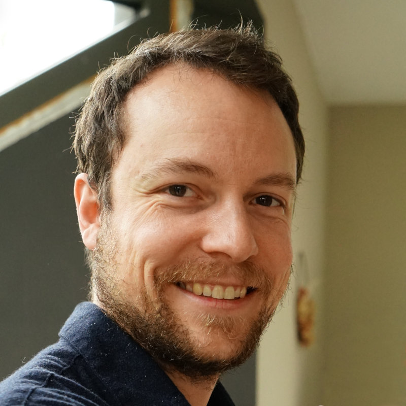

**Lucas Vanoverberghe**

**AI Software Engineer • Data & BI • Creative Developer**

birth_date = 1992-06-25
career_start = 2016-01-01

## Experience

### AI Tech Lead @ [D'Ieteren](https://www.dieterengroup.com/dieteren-automotive/)

*2023-now* - Braine-l'Alleud, Belgium

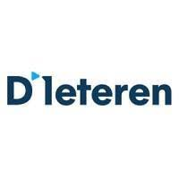

#### Projects

##### Amelia WhatsApp AI assistant


- Multi-agent Customer Care chatbot
    - Conversational appointment booking process
- Role
    - Designed software architecture
    - Defined and implemented multi-agents, tools, connectors and integrations
    - Coaching and onboarding of developers
- Tech stack
    - Python + FastAPI
    - uv
    - Docker + Azure Container App
    - PostgreSQL
    - Azure OpenAI + OpenAI Agents SDK
    - Azure DevOps + Terraform
    - OpenTelemetry + Azure Logs + Phoenix + Grafana

##### Customer Care automation


- Accelerate Customer Care tickets processing
- GenAI to automate:
    - Summarizing cases
    - Prioritizing cases
    - Assigning cases to the right team
    - Generating email answers using a knowledge base (RAG)
- Role
    - Designed and implemented software architecture
- Tech stack
    - Python + FastAPI
    - Docker + Azure Function App
    - FAISS vector database
    - Azure OpenAI, GPT, embedding model
    - Odoo integration
    - Structured logging

##### Amelia Car Configuration chatbot - BMS 2025

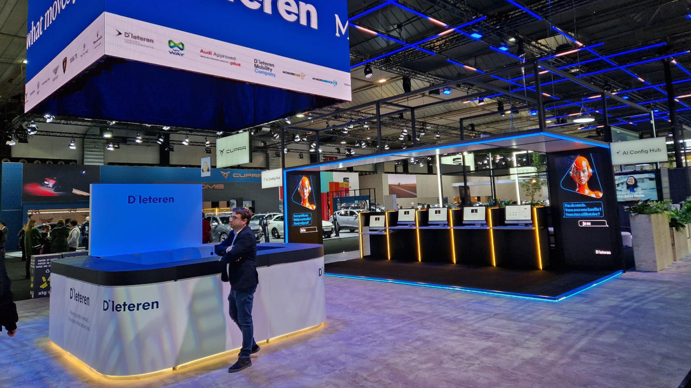

- Kiosk Web app to let users configure their new car using an interactive conversational AI UX at Brussels Motor Show 2025
- Role
    - Designed and implemented back-end software architecture
    - Coaching and onboarding of developers
- Tech stack
    - Python + FastAPI
    - poetry
    - Docker + Azure Container App
    - Azure CosmosDB
    - DuckDB
    - Azure OpenAI
    - Azure Logs

##### Automated Car Offer creation from PDF

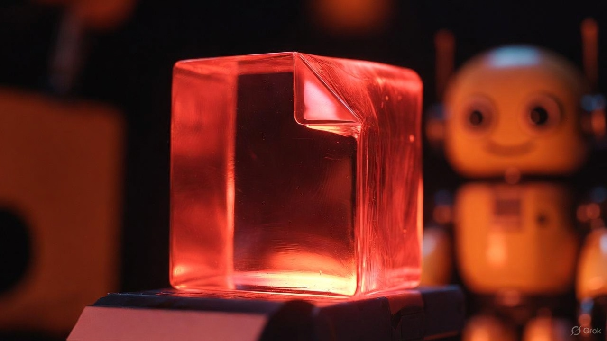

- Intelligent PDF document parsing with OCR + GenAI
    - Smart interpretation and matching of car equipment using GenAI
    - Automatically create assets in existing systems using APIs
- Tech stack
    - Python + FastAPI
    - Azure Document Intelligence

##### Interactive AI chatbots

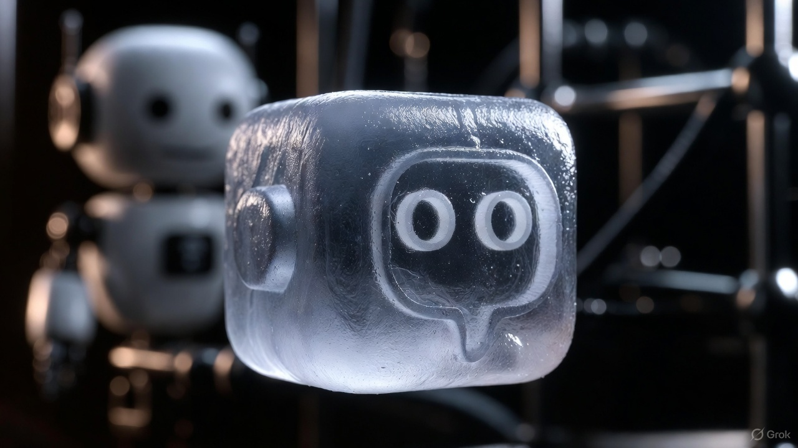

- Various chatbots and POCs
- Tech stack
    - Python + Streamlit
    - Azure OpenAI, GPT, embedding model
    - Pandas + DuckDB
    - Microsoft AutoGen
    - LangChain + LangGraph

### Data Engineer & BI Developer @ [D'Ieteren](https://www.dieterengroup.com/dieteren-automotive/)

*2016-2023* - Braine-l'Alleud, Belgium


Data marts and reporting for Sales, Aftersales, CRM covering a broad variety of D'Ieteren's activities and companies.

#### Tech stack

- Data Vault data warehouse
- ETL automation
- T-SQL
- Azure Data Factory
- Powershell
- Power BI
- IBM Cognos
- QlikView
- Java

### Data Consultant @ [AKABI](https://www.akabi.eu/)

*2016-2023* - Brussels, Belgium

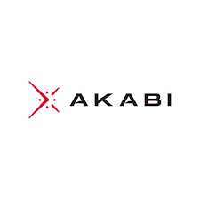

- BI and Data Engineering
- Created trainings and seminars

### Data Vault Expert @ [Lacoste](https://www.lacoste.com/)

*2020-2021* - Paris, France

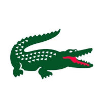

5-days coaching mission to help design an enterprise-wide Data Vault data warehouse model for all retail business activities of Lacoste.

### iOS Developer @ [Stumber](https://www.instagram.com/stumberapp/)

*Sep.-dec. 2015* - Brussels, Belgium


- End-to-end development of an iOS application with Swift.
- Stumber was a tailored social network app for university students and companies.

### Web Developer @ [Sendsteps](https://www.sendsteps.com/)

*Jan.-may. 2013* - Amsterdam, Netherlands


- Internship in Dutch market leader in mobile interaction during presentations.
- Developed a real time web application to record audience interaction (votes, questions,…) and performed website maintenance.

## Skills and Technologies

Broad technical knowledge and experience.

### Soft skills


- Creativity and problem solving
- Popularization of AI and blockchain concepts
- Teaching, coaching
- Presentations

### Programming languages

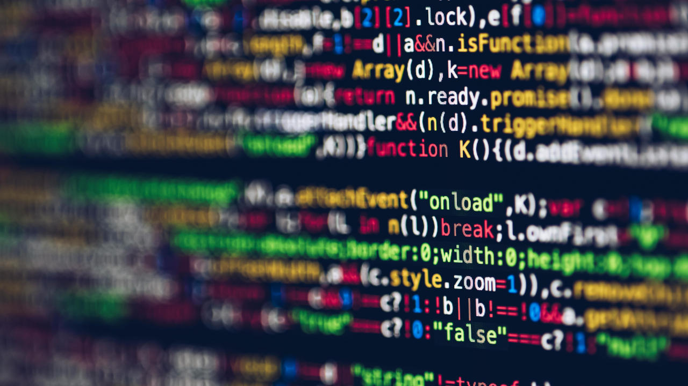

- Python
- SQL
- Java
- Bash, Linux
- C# .NET
- C++
- Kusto (KQL)

### Generative AI

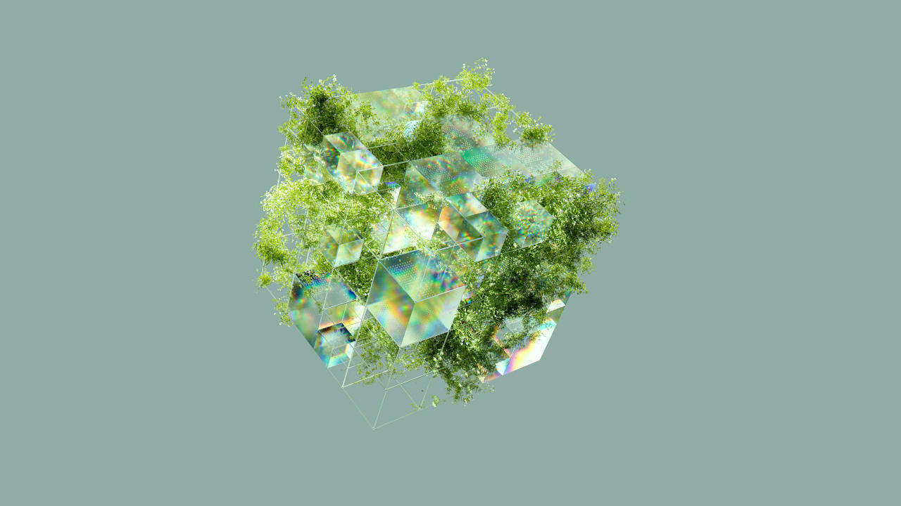

- Multi-agent topologies
- RAG
- Embeddings and vector representations
- MCP
- Auditability
- Prompt composition
- Guardrails
- etc.

### Software engineering

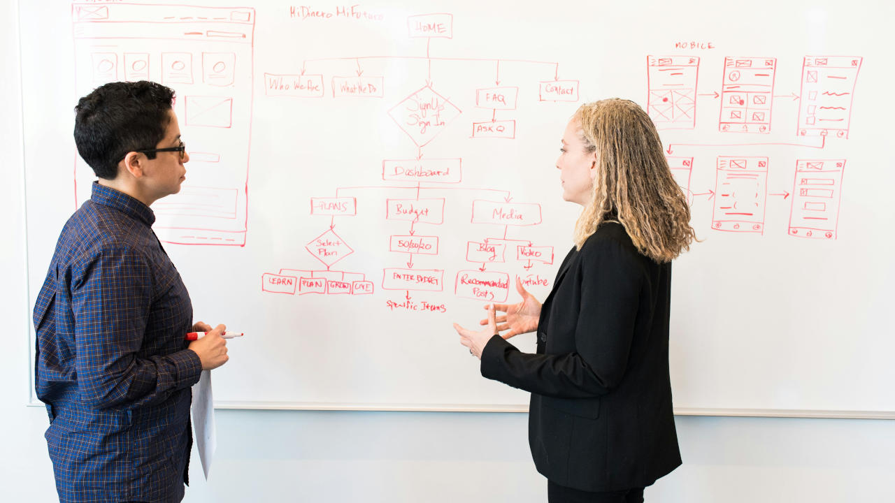

- Solution architecture
- Hexagonal architecture
- OOP, functional programming
- Modern design patterns
- Dependency injection
- Pub/sub, queues
- Maintainability
- TDD
- etc.

### Databases


- PostgreSQL
- Microsoft SQL Server
- Azure CosmosDB
- MySQL / MariaDB

### DevOps tools

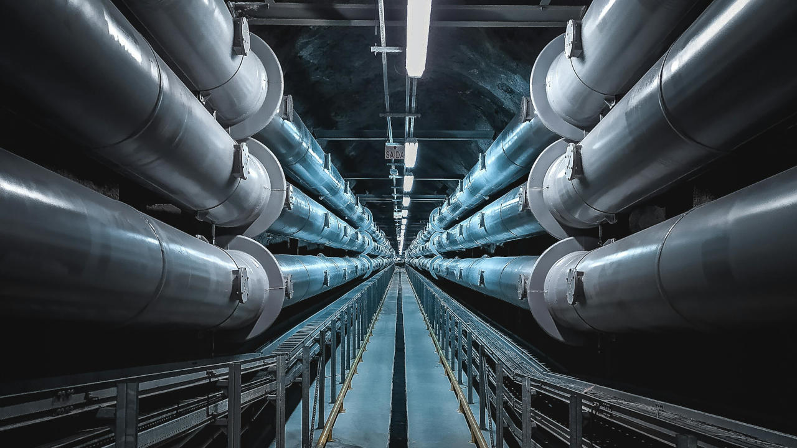

- Docker
- Git
- Terraform
- Jira

## Certification

### Oracle Database SQL Certified Expert

```html
<div>
    <div data-iframe-width="150" data-iframe-height="270" data-share-badge-id="f250e7a1-1ef6-44e8-85a1-4836d99485f6"></div>
    <script type="text/javascript">
        (function() {
            var s = document.createElement('script');
            s.type = 'text/javascript';
            s.async = true;
            s.src = '//cdn.youracclaim.com/assets/utilities/embed.js';
            var o = document.getElementsByTagName('script')[0];
            o.parentNode.insertBefore(s, o);
        })();
    </script>
</div>
```

[Passed with 94% score](https://www.youracclaim.com/badges/f250e7a1-1ef6-44e8-85a1-4836d99485f6/public_url).

## Education

### Master's degree in Computer Science @ [UMONS](https://web.umons.ac.be/)

2013-2016 - Mons, Belgium

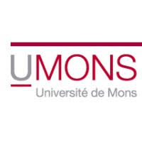

- Software engineering and evolution
- Optimization and metaheuristics
- Machine learning
- Artificial intelligence
- Data mining
- Data structures
- Graph theory
- Computational science
- Entrepreneurship
- Various software development projects
- Thesis on an original random-vector genetic algorithm to solve the Cover Printing Problem

Diploma obtained in 2019 with distinction.

### Bachelor's degree in IT Systems & Technologies @ [HELHa](https://www.helha.be/)

2010-2013 - Tournai, Belgium

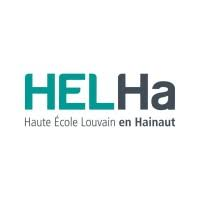

- Application development
- Networks
- Systems administration and maintenance
- Microchips
- Electronics

Diploma obtained with distinction.

### French Baccalauréat in Sciences @ [Lycée Blaise Pascal](https://www.bpascal.fr/)

2007-2010 - Longuenesse, France


Sciences de l'ingénieur.
Obtained the Engineering Science Baccalauréat (i.e. French National Examination for access to higher education studies) with honours.

## Languages

- French: native (100%)
- English: full professional proficiency (95%)
- Dutch: basic (25%)

## Contact

- [LinkedIn](https://www.linkedin.com/in/vanolucas)
- contact@vanolucas.com

## Socials

- [GitHub](https://github.com/vanolucas)
- [Facebook](https://www.facebook.com/vanolucas)
- [X](https://x.com/vanolucas)
